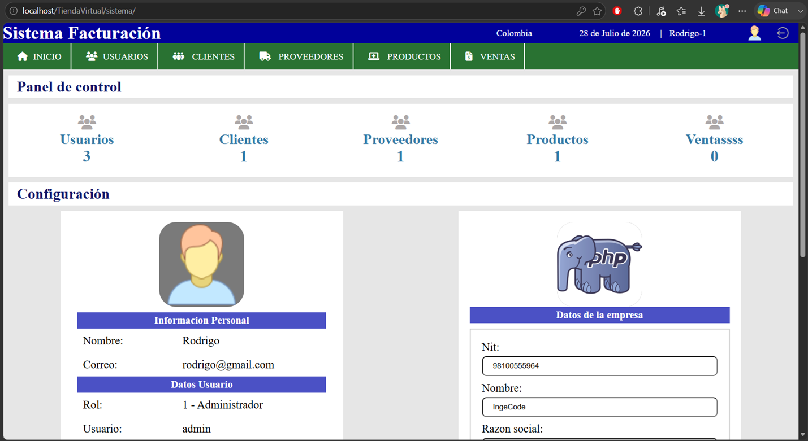

# TiendaVirtual - Sistema Web de Facturación y Gestión Comercial 


---

# 📖 Descripción

**TiendaVirtual** es un sistema web administrativo desarrollado en **PHP** (procedural) y **MySQL**, diseñado para gestionar de manera integral el catálogo de productos, los clientes, los proveedores, los usuarios y el proceso de facturación de un negocio.

La aplicación permite centralizar la gestión de inventario, clientes y control de ventas, ayudando a automatizar las operaciones comerciales. Incluye además generación de facturas en PDF mediante la librería **dompdf**.

El sistema cuenta con autenticación de usuarios, manejo de sesiones, control de roles, operaciones CRUD, acceso a datos mediante **MySQLi**, uso de procedimientos almacenados, gestión de dependencias con **Composer** y comunicación dinámica utilizando **AJAX**.

---

# 🖼️ Vista previa



---

# ✨ Características principales

- 🔐 Sistema de autenticación con sesiones PHP y control de accesos por rol.
- 👥 Administración de usuarios (alta, edición, listado, búsqueda, baja lógica).
- 🧑‍🤝‍🧑 Gestión de clientes y proveedores (alta, edición, listado, búsqueda, baja lógica).
- 📦 Catálogo y gestión de productos, con entradas de mercancía y actualización automática de existencias vía procedimiento almacenado.
- 🛒 Módulo de nueva venta con carrito de productos gestionado por AJAX.
- 📄 Generación de facturas en formato PDF (Dompdf) a partir de una plantilla HTML propia.
- 📊 Panel de control (dashboard) con datos agregados mediante procedimiento almacenado.
- ⚡ Operaciones asíncronas y dinámicas mediante AJAX + jQuery.
- 🗄 Gestión de información mediante base de datos relacional MySQL.
- 📦 Dependencias (Dompdf) incluidas directamente en el repositorio (carpeta `vendor/`).

---

# 📂 Estructura del proyecto

```
TiendaVirtual/
│
├── conexion.php                  # Configuración y conexión a MySQL (mysqli)
├── index.php                     # Login del sistema
│
├── BaseDeDatos/
│   └── tienda_virtual_1.sql      # Script de creación de la base de datos
│
├── css/                          # Estilos del login
├── img/                          # Imágenes generales (logo, login, etc.)
│
├── sistema/                      # Panel administrativo (requiere sesión activa)
│   ├── index.php                 # Dashboard / panel de control
│   ├── ajax.php                  # Endpoint central de peticiones AJAX
│   ├── salir.php                 # Cierre de sesión
│   ├── registro_*.php            # Altas (usuario, cliente, proveedor, producto)
│   ├── editar_*.php              # Ediciones
│   ├── lista_*.php               # Listados
│   ├── buscar_*.php              # Búsquedas
│   ├── eliminar_confirmar_*.php  # Bajas lógicas
│   ├── nueva_venta.php           # Registro de ventas
│   ├── lista_factura.php         # Listado de facturas
│   ├── buscar_factura.php        # Búsqueda de facturas
│   │
│   ├── factura/                  # Generación de facturas en PDF
│   │   ├── factura.php
│   │   ├── factura_plantilla.php
│   │   ├── generaFactura.php     # Lógica con Dompdf
│   │   └── style.css
│   │
│   ├── pdf/                      # Dependencias Composer del módulo de facturas
│   │
│   ├── includes/
│   │   ├── header.php            # Encabezado + verificación de sesión
│   │   ├── nav.php               # Menú de navegación
│   │   ├── footer.php
│   │   ├── scripts.php           # Carga de jQuery, Font Awesome, CSS
│   │   └── functions.php         # Funciones auxiliares
│   │
│   ├── css/                      # Estilos del panel
│   ├── jss/                      # Scripts JS del panel
│   └── img/                      # Iconos e imágenes del panel
│
├── vendor/                       # Dependencias Composer (Dompdf), incluidas en el repositorio
├── composer.json
└── composer.lock
```

---

# 💻 Tecnologías utilizadas

## Backend
- PHP (procedural)
- MySQL / MySQLi
- Procedimientos almacenados
- Composer & Dompdf

## Frontend
- HTML5
- CSS3
- JavaScript
- AJAX
- jQuery
- Font Awesome

## Arquitectura
- PHP procedural organizado por funcionalidad (no implementa MVC formal)

---

# ⚙️ Funcionalidades del sistema

- ✔ Inicio de sesión, control de roles y autenticación de usuarios.
- ✔ Gestión completa del inventario de productos.
- ✔ Administración y registro de clientes y proveedores.
- ✔ Procesamiento y control de ventas.
- ✔ Generación automatizada de facturas en PDF.
- ✔ Interacción dinámica de formularios con AJAX.
- ✔ Conexión con base de datos mediante MySQLi.

---

# ⚙️ Requisitos

- PHP 7.4 o superior (con extensión mysqli).
- MySQL 5.7 o superior.
- Servidor Apache (XAMPP, WAMP o Laragon).
- Navegador web moderno.

> No es necesario instalar Composer: la carpeta `vendor/` con las dependencias (Dompdf) ya viene incluida en el repositorio.

---

# 🚀 Instalación

## 1. Clonar el repositorio
```
git clone https://github.com/tu-usuario/TiendaVirtual.git
```

## 2. Configurar servidor local
Copiar la carpeta del proyecto dentro del directorio raíz de tu servidor web local.
Ejemplo utilizando XAMPP: `D:/Instalados/Xampp/htdocs/TiendaVirtual`

## 3. Crear la base de datos
Crear una base de datos en tu gestor MySQL llamada: `tienda_virtual_1`
Posteriormente, importa el archivo de respaldo incluido en el proyecto: `BaseDeDatos/tienda_virtual_1.sql`

## 4. Configurar conexión a la base de datos
Editar el archivo `conexion.php` en la raíz del proyecto y modificar los parámetros de conexión de acuerdo con las credenciales de tu entorno local.

## 5. Ejecutar la aplicación
Abre tu navegador web e ingresa a la siguiente ruta: `http://localhost/TiendaVirtual`
Usuario de prueba: `admin` / Clave: `123`

---

# 🧠 Arquitectura del proyecto

El sistema no implementa un patrón MVC formal; sigue una organización de PHP procedural distribuida por funcionalidad, donde cada módulo (usuarios, clientes, proveedores, productos, ventas) tiene sus propios archivos de alta, edición, listado y búsqueda.

```
Usuario ──> Vista PHP ──> AJAX (jQuery) ──> sistema/ajax.php ──> MySQL (mysqli) ──> Respuesta JSON / Factura PDF (Dompdf)
```

---

# 🎯 Objetivos del proyecto

- Proveer una plataforma funcional de gestión comercial y facturación.
- Automatizar el control de productos, ventas e inventarios.
- Centralizar la información de clientes y proveedores.
- Aplicar buenas prácticas de desarrollo backend con PHP y MySQL.

---

# 🧠 Conocimientos aplicados

Durante el desarrollo de este proyecto se consolidaron competencias en:
- Desarrollo backend estructurado con PHP.
- Diseño, modelado y administración de bases de datos relacionales en MySQL.
- Uso de procedimientos almacenados.
- Manejo de sesiones, control de roles y autenticación.
- Comunicación asíncrona cliente-servidor mediante AJAX.
- Integración de librerías externas de terceros con Composer (Dompdf).
- Generación de documentos PDF a partir de plantillas HTML.

---

# 🚀 Mejoras futuras

- Migrar el acceso a datos de MySQLi a PDO con sentencias preparadas.
- Reemplazar el hash MD5 de contraseñas por password_hash().
- Reorganizar el proyecto bajo un patrón MVC.
- Externalizar credenciales sensibles mediante variables de entorno (.env).
- Incorporar un framework CSS (Bootstrap/Tailwind) para mejorar la responsividad.
- Añadir un sistema de notificaciones automáticas por correo electrónico.

---

# 👨‍💻 Autor

RODRIGO CANTOR VASQUEZ - Desarrollador de Software
GitHub: https://github.com/rcvunicun-lgtm

---

# ⭐ Si este proyecto te resulta útil...

No olvides regalarle una ⭐ al repositorio en GitHub.